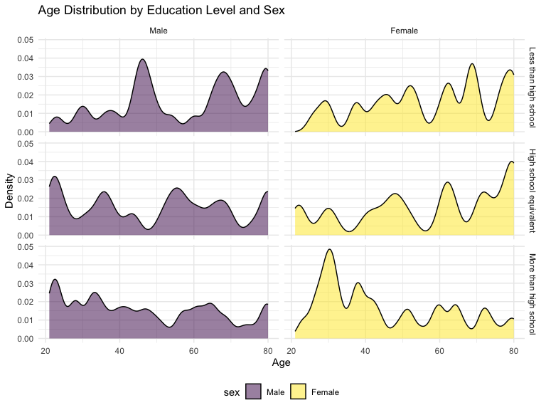

p8105_hw3_ts3670
================
Tong Su
2024-10-17

## Problem 1

``` r
data("ny_noaa")
```

## Problem 2

``` r
accelerometer_df = read_csv("./data/nhanes_accel.csv") |>
  janitor::clean_names()
```

    ## Rows: 250 Columns: 1441
    ## ── Column specification ────────────────────────────────────────────────────────
    ## Delimiter: ","
    ## dbl (1441): SEQN, min1, min2, min3, min4, min5, min6, min7, min8, min9, min1...
    ## 
    ## ℹ Use `spec()` to retrieve the full column specification for this data.
    ## ℹ Specify the column types or set `show_col_types = FALSE` to quiet this message.

``` r
demographics_df = read_csv("./data/nhanes_covar.csv",skip = 4)|> 
  filter(age >= 21) |>
  drop_na()|>
  janitor::clean_names()
```

    ## Rows: 250 Columns: 5
    ## ── Column specification ────────────────────────────────────────────────────────
    ## Delimiter: ","
    ## dbl (5): SEQN, sex, age, BMI, education
    ## 
    ## ℹ Use `spec()` to retrieve the full column specification for this data.
    ## ℹ Specify the column types or set `show_col_types = FALSE` to quiet this message.

``` r
MIMS_df <- accelerometer_df |>
  inner_join(demographics_df, by = "seqn")
```

``` r
education_gender <- MIMS_df |>
  group_by(education, sex) |>
  summarise(count = n()) |>
  spread(key = sex, value = count, fill = 0)
```

    ## `summarise()` has grouped output by 'education'. You can override using the
    ## `.groups` argument.

``` r
  ggplot(MIMS_df, aes(x = age, fill = sex)) +
  geom_density(alpha = .5) + 
  facet_grid(education ~ sex,
             labeller = labeller(sex = c("1" = "Men", "2" = "Women"))) +
  labs(title = "Age Distribution by Education Level and Sex",
       x = "Age",
       y = "Density") 
```


