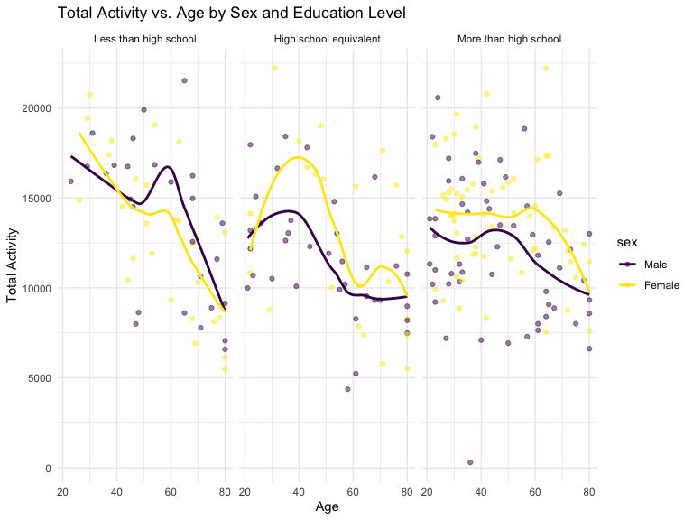
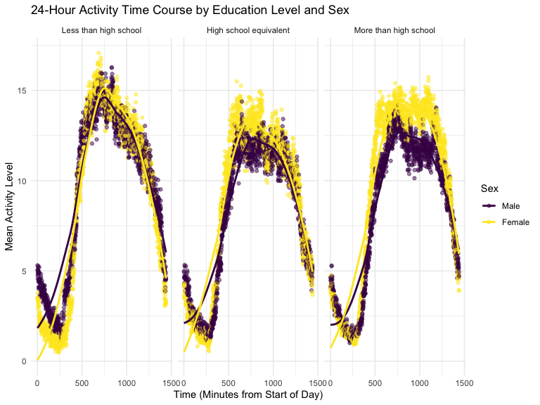
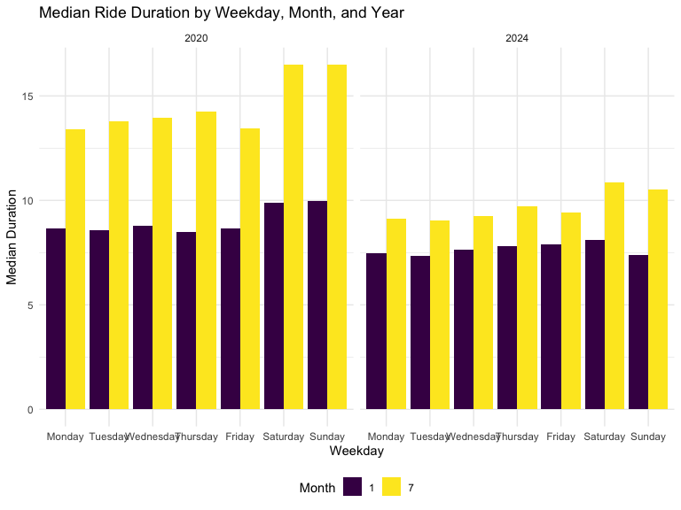

p8105_hw3_ts3670
================
Tong Su
2024-10-16

## Problem 1

``` r
data("ny_noaa")
```

## Problem 2

``` r
accelerometer_df = read_csv("./data/nhanes_accel.csv") |>
  janitor::clean_names()
```

    ## Rows: 250 Columns: 1441
    ## ── Column specification ────────────────────────────────────────────────────────
    ## Delimiter: ","
    ## dbl (1441): SEQN, min1, min2, min3, min4, min5, min6, min7, min8, min9, min1...
    ## 
    ## ℹ Use `spec()` to retrieve the full column specification for this data.
    ## ℹ Specify the column types or set `show_col_types = FALSE` to quiet this message.

``` r
demographics_df = read_csv("./data/nhanes_covar.csv",skip = 4)|> 
  filter(age >= 21) |>
  janitor::clean_names()
```

    ## Rows: 250 Columns: 5
    ## ── Column specification ────────────────────────────────────────────────────────
    ## Delimiter: ","
    ## dbl (5): SEQN, sex, age, BMI, education
    ## 
    ## ℹ Use `spec()` to retrieve the full column specification for this data.
    ## ℹ Specify the column types or set `show_col_types = FALSE` to quiet this message.

``` r
MIMS_df = 
  inner_join(demographics_df,accelerometer_df, by = "seqn")|>
  drop_na(sex, age, bmi, education) |>
  pivot_longer(cols = starts_with("min"),
               names_to = "minute",
               values_to = "acc") |>
  mutate(sex = factor(sex,
                      levels = c(1, 2),
                      labels = c("Male", "Female"),
                      ordered = TRUE)) |>
  mutate(education = factor(education,
                            levels = c(1, 2, 3),
                            labels = c("Less than high school", "High school equivalent", "More than high school"),
                            ordered = TRUE))
```

``` r
education_gender = MIMS_df |>
  group_by(education, sex) |>
  summarise(count = n()) |>
  spread(key = sex, value = count, fill = 0)
```

    ## `summarise()` has grouped output by 'education'. You can override using the
    ## `.groups` argument.

``` r
  ggplot(MIMS_df, aes(x = age, fill = sex)) +
  geom_density(alpha = .5) + 
  facet_grid(education ~ sex,
             labeller = labeller(sex = c("1" = "Men", "2" = "Women"))) +
  labs(title = "Age Distribution by Education Level and Sex",
       x = "Age",
       y = "Density") 
```


``` r
total_activity_data = MIMS_df |>
  group_by(seqn, sex, age, education) |>
  summarize(total_activity = sum(acc, na.rm = TRUE))
```

    ## `summarise()` has grouped output by 'seqn', 'sex', 'age'. You can override
    ## using the `.groups` argument.

``` r
ggplot(total_activity_data, aes(x = age, y = total_activity, color = sex)) +
  geom_point(alpha = 0.5) + 
  geom_smooth(method = "loess", se = FALSE) +  
  facet_wrap(~education) +  
  labs(title = "Total Activity vs. Age by Sex and Education Level",
       x = "Age",
       y = "Total Activity") +
  theme_minimal()
```

    ## `geom_smooth()` using formula = 'y ~ x'



``` r
time_course_data <- MIMS_df |>
  group_by(minute, sex, education) %>%
  summarize(mean_activity = mean(acc, na.rm = TRUE))
```

    ## `summarise()` has grouped output by 'minute', 'sex'. You can override using the
    ## `.groups` argument.

``` r
ggplot(time_course_data, aes(x = as.numeric(gsub("min", "", minute)), y = mean_activity, color = sex)) +
  geom_point( alpha = 0.5) +
  geom_smooth(se = FALSE, method = "loess") + 
  facet_wrap(~education) +
  labs(title = "24-Hour Activity Time Course by Education Level and Sex",
       x = "Time (Minutes from Start of Day)",
       y = "Mean Activity Level",
       color = "Sex") +
  theme_minimal()
```

    ## `geom_smooth()` using formula = 'y ~ x'



\##Problem 3

``` r
jan_2020 = read.csv("./data/citibike/Jan 2020 Citi.csv") |>
  mutate(year = as.factor(2020), month = as.factor(1)) |>
  janitor::clean_names() 

jan_2024 = read.csv("./data/citibike/Jan 2024 Citi.csv") |>
  mutate(year = as.factor(2024), month = as.factor(1)) |>
  janitor::clean_names()

july_2020 = read.csv("./data/citibike/July 2020 Citi.csv") |>
  mutate(year = as.factor(2020), month = as.factor(7)) |>
  janitor::clean_names()

july_2024 = read.csv("./data/citibike/July 2024 Citi.csv") |>
  mutate(year = as.factor(2024), month = as.factor(7)) |>
  janitor::clean_names()

citi_full = bind_rows(jan_2020, jan_2024, july_2020, july_2024) |>
  select(ride_id:rideable_type, year, month, everything()) |>
  mutate(
    rideable_type = as.factor(rideable_type),
    weekdays = as.factor(weekdays),
    duration = as.numeric(duration),
    start_station_name = as.factor(start_station_name),
    end_station_name = as.factor(end_station_name),
    member_casual = as.factor(member_casual)
  ) |>
  na.omit()
```

``` r
summary_table = citi_full |>
  group_by(year, month, member_casual) |>
  summarise(total_rides = n()) |>
  pivot_wider(names_from = member_casual, values_from = total_rides, names_prefix = "num_")
```

    ## `summarise()` has grouped output by 'year', 'month'. You can override using the
    ## `.groups` argument.

``` r
summary_table
```

    ## # A tibble: 4 × 4
    ## # Groups:   year, month [4]
    ##   year  month num_casual num_member
    ##   <fct> <fct>      <int>      <int>
    ## 1 2020  1            980      11418
    ## 2 2020  7           5625      15388
    ## 3 2024  1           2094      16705
    ## 4 2024  7          10843      36200

``` r
busy_stations = citi_full |>
  filter(year == 2024, month == 7) |>
  group_by(start_station_name) |>
  summarise(num_rides = n()) |>
  arrange(desc(num_rides)) |>
  slice_head(n = 5)

busy_stations
```

    ## # A tibble: 5 × 2
    ##   start_station_name       num_rides
    ##   <fct>                        <int>
    ## 1 Pier 61 at Chelsea Piers       163
    ## 2 University Pl & E 14 St        155
    ## 3 W 21 St & 6 Ave                152
    ## 4 West St & Chambers St          150
    ## 5 W 31 St & 7 Ave                145

``` r
duration_plot = citi_full |>
  mutate(weekdays = factor(weekdays, levels = c("Monday", "Tuesday", "Wednesday", "Thursday", "Friday", "Saturday", "Sunday"))) |>
  group_by(year, month, weekdays) |>
  summarise(median_dur = median(duration)) |>
  ggplot(aes(x = weekdays, y = median_dur, fill = month)) +
  geom_bar(stat = "identity", position = "dodge") +
  facet_wrap(~year) +
  labs(title = "Median Ride Duration by Weekday, Month, and Year",
       x = "Weekday", y = "Median Duration", fill = "Month")
```

    ## `summarise()` has grouped output by 'year', 'month'. You can override using the
    ## `.groups` argument.

``` r
duration_plot
```


